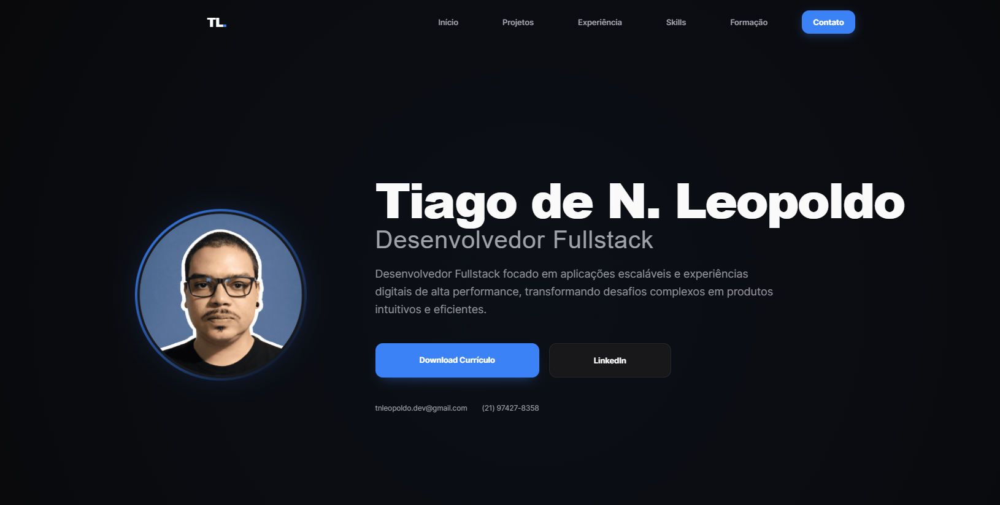
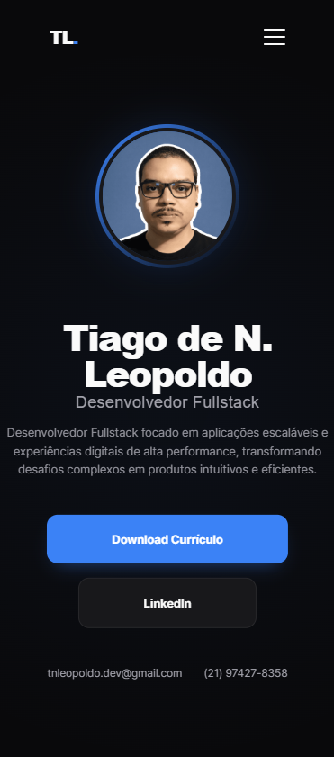

# Portfólio Tiago de Noronha Leopoldo


## Descrição
Este é o portfólio pessoal de Tiago de Noronha Leopoldo, desenvolvido para apresentar projetos, habilidades e experiências de forma profissional e atrativa. O projeto utiliza o conceito de Atomic Design para organizar os componentes e garantir escalabilidade.

---

## Demonstração Visual

### Esboço do Planejamento Inicial


### Resultado Atual

#### Versão Desktop


#### Versão Mobile


---

## Instalação e Execução

Siga os passos abaixo para rodar o projeto localmente:

1. **Clone o repositório:**
   ```bash
   git clone https://github.com/TiagoLeopoldo/react-ts-new-portfolio.git
   ```

2. **Instale as dependências:**
   ```bash
   npm install
   ```

3. **Inicie o servidor de desenvolvimento:**
   ```bash
   npm run dev
   ```

4. **Acesse a aplicação:**
   Abra o navegador e acesse `http://localhost:5173`.

---

## Tecnologias Utilizadas

- **React**: Biblioteca para construção de interfaces de usuário.
- **TypeScript**: Superset do JavaScript para tipagem estática.
- **Vite**: Ferramenta de build rápida para desenvolvimento.
- **CSS Modules**: Estilização modular para componentes.
- **Atomic Design**: Metodologia para organização de componentes.

---

## Funcionalidades Principais

- Design responsivo para diferentes tamanhos de tela.
- Navegação intuitiva com menu interativo.
- Estrutura modular e escalável baseada em Atomic Design.

---

## Estrutura de Pastas

```plaintext
src/
├── assets/         # Recursos estáticos (imagens, ícones)
├── components/     # Componentes organizados por Atomic Design
│   ├── atoms/      # Componentes básicos (ex: Button)
│   ├── molecules/  # Combinações de átomos (ex: Navbar)
│   └── organisms/  # Combinações de moléculas (ex: Header)
├── layout/         # Layouts principais
├── pages/          # Páginas da aplicação
└── types/          # Definições de tipos TypeScript
```

---

## Como Usar

1. Navegue pelo menu para explorar as seções do portfólio.
2. Visualize os projetos e leia as descrições detalhadas.
3. Entre em contato através das informações fornecidas na seção de contato.

---

## Contato

- **Autor:** Tiago de Noronha Leopoldo
- **Email:** tnleopoldo.dev@gmail.com
- **GitHub:** [TiagoLeopoldo](https://github.com/TiagoLeopoldo)

---

Desenvolvido por Tiago de Noronha Leopoldo.