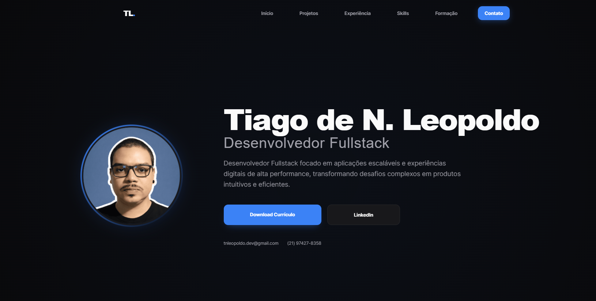
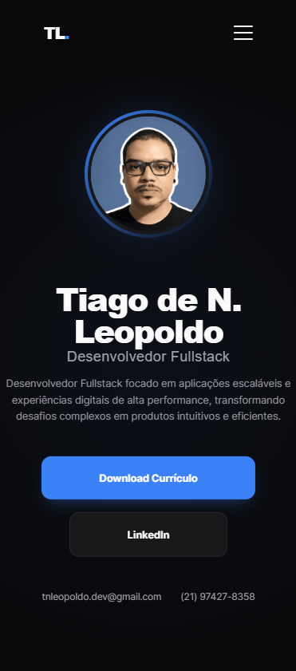

# Portfólio Tiago de Noronha Leopoldo


## Descrição
Este é o portfólio pessoal de Tiago de Noronha Leopoldo, desenvolvido para apresentar projetos, habilidades e experiências de forma profissional e atrativa. O projeto utiliza o conceito de Atomic Design para organizar os componentes e garantir escalabilidade. Ele foi desenvolvido utilizando React com TypeScript e Vite, garantindo alta performance e modularidade.

---

## Demonstração Visual

### Esboço do Planejamento Inicial


### Resultado Atual

#### Versão Desktop


#### Versão Mobile


---

## Instalação e Execução

Siga os passos abaixo para rodar o projeto localmente:

1. **Clone o repositório:**
   ```bash
   git clone https://github.com/TiagoLeopoldo/react-ts-new-portfolio.git
   ```

2. **Instale as dependências:**
   ```bash
   npm install
   ```

3. **Inicie o servidor de desenvolvimento:**
   ```bash
   npm run dev
   ```

4. **Acesse a aplicação:**
   Abra o navegador e acesse `http://localhost:5173`.

---

## Estrutura do Projeto

O projeto segue a seguinte estrutura de pastas:

- **src/**: Contém todo o código-fonte da aplicação.
  - **components/**: Componentes reutilizáveis organizados em átomos, moléculas e organismos.
  - **pages/**: Páginas principais da aplicação.
  - **services/**: Serviços para manipulação de dados e integração com APIs.
  - **assets/**: Recursos estáticos como imagens, ícones e fontes.

- **public/**: Arquivos públicos acessíveis diretamente.
- **docs/**: Documentação e imagens relacionadas ao projeto.

---

## Tecnologias Utilizadas

- **React** com **TypeScript**
- **Vite** para build e desenvolvimento
- **CSS Modules** para estilização
- **ESLint** e **Prettier** para padronização de código

---

## Contribuição

Contribuições são bem-vindas! Siga os passos abaixo para contribuir:

1. Faça um fork do repositório.
2. Crie uma nova branch para sua feature ou correção de bug.
3. Envie um pull request descrevendo suas alterações.

---

## Contato

- **Autor:** Tiago de Noronha Leopoldo
- **Email:** tnleopoldo.dev@gmail.com
- **GitHub:** [TiagoLeopoldo](https://github.com/TiagoLeopoldo)

---

Desenvolvido por Tiago de Noronha Leopoldo.